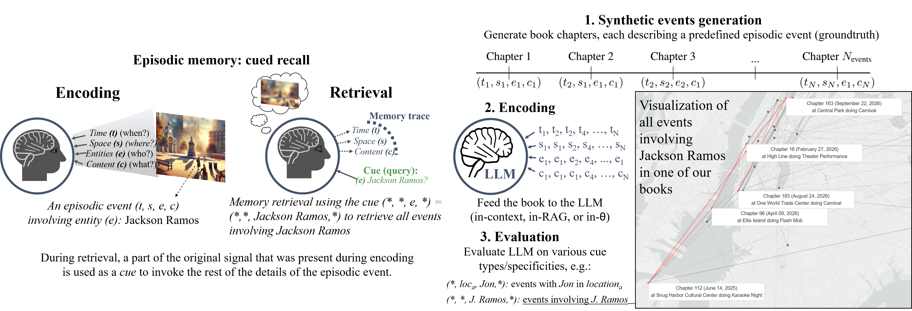

<div align="center">

# 🧠 The Tulving Episodic Memory Benchmark 📚

## Evaluating Episodic Memory in Large Language Models 

*In honor of Endel Tulving (1927-2023), whose pioneering work on episodic memory inspired this work and fundamentally shaped our understanding of human memory systems.*

**Accepted at ICLR 2025**

[](https://arxiv.org/abs/2501.13121) [](https://opensource.org/licenses/MIT) [](https://iclr.cc/Conferences/2025)


#### A framework for measuring how well LLMs can encode, store, and recall episodic events across extended narratives.





</div>

## 🏆 Ranking (in-context memory)

We evaluated different models focusing on two critical aspects of episodic memory:
- **🎯 Simple Recall Score**: Measures the model's ability to accurately recall episodic events,
- **⏱️ Chronological Awareness Score**: Assesses how well the model tracks entity states and temporal sequences.


| Model   | 🎯 Simple Recall  | ⏱️ Chronological Awareness  |
|:---------------------------:|:-------------------:|:-------------------:|
gemini-2.5-pro🆕²          | 0.968 🥇 | 0.796 🥉
gemini-2.5-flash🆕²        | 0.960 🥈 | 0.817 🥇
gpt-5🆕²                   | 0.942 🥉 | 0.804 🥈
gpt-5-mini🆕²              | 0.830     | 0.442
claude-sonnet-4🆕²         | 0.790     | 0.326
grok-4-fast-reasoning🆕²   | 0.726    | 0.281
gemini-2-pro🆕¹            | 0.708    | 0.290 
gemini-2-flash-thinking🆕¹ | 0.708    | 0.288 
gpt-4o                     | 0.670     | 0.204 
grok-4-fast-non-reasoning🆕² | 0.602	  | 0.122
deepseek-v3🆕¹ 	           | 0.600	  | 0.103
gemini-2-flash🆕¹          | 0.596    | 0.173
deepseek-r1🆕¹             |	0.572   | 0.147
llama-3.1-405b             | 0.504    | 0.129 
gpt-4o-mini                | 0.492    | 0.077
claude-3-haiku             | 0.470    | 0.109 
claude-3-5-sonnet          | 0.470    | 0.090
o3-mini🆕¹                 | 0.424    | 0.044
o1🆕¹                      | 0.384    | 0.052
gpt-4.1-nano🆕²            | 0.356    | 0.090
o1-mini                    | 0.300     | 0.033

🆕¹ Evaluated after paper acceptance (February'25)
🆕² Evaluated after paper acceptance (September'25)

<details markdown="1"><summary>Details.</summary>

- Benchmark used: default long (Synaptic Echoes), the narrative containing 200 chapters, 100k tokens, and 686 Q&As.
- Simple Recall Score: questions are first grouped by their number of matching events (0, 1, 2, 3-5, or 6+ events) and each group's F1-scores are averaged. Group 0 checks for hallucination by having no correct answers, group 1 evaluates single entity tracking, and other groups tests tracking of multiple entities. Finally, the score is the average of the grouped F1-scores.
- Chronological Awareness Score: average of two scores: (1) Latest State score, averaging over questions checking if the most recent state is correct, and (2) Chronological Order score, averaging Kendall's τ coefficients over questions requiring temporal ordering (τ is computed between predicted and ground truth lists when all elements are found, 0 otherwise).

Note: for deepseek-v3, deepseek-r1, and llama-3.1-405b, we used openrouter to run the experiments.

[Please refer to our paper for additional details.]

</details>

## 🔑 Key Features

- **🕮 Synthetic Dataset Generator**: Creates book-like narratives with detailed narratives of events
- **📋 Comprehensive Q&A Suite**: Question-answer pairs specifically designed to probe episodic memory capabilities
- **🔍 Robust Evaluation Framework**: Automated assessment system for measuring model performance

### 🕮 Synthetic Dataset Generator

Our framework generates book-like narratives where each event includes a date, location, entity name, and detailed content - capturing the core elements of episodic memory.


<div align="center">
<div style="display: flex; justify-content: center; margin: 20px 0;">
    
</div>
</div>

Events are designed to have recurring elements. For example, in one of the produced dataset, the entity "Jackson Ramos" appears in five different chapters, enabling evaluation of the model's ability to track and recall multiple occurrences of the same entity across the narrative. [Click to view tracking of Jackson Ramos over NYC map](figs/ny_big.png)

### 📋 Q&A Suite

The benchmark includes a comprehensive set of episodic memory questions based on cue composition and retrieval types:
(full list of 36 question templates in the paper)

| Cue&nbsp;&nbsp;&nbsp;&nbsp;&nbsp;&nbsp;&nbsp;&nbsp;&nbsp;&nbsp;&nbsp;&nbsp;&nbsp;&nbsp; | Description | Retrieved trace&nbsp;&nbsp;&nbsp;&nbsp;&nbsp;&nbsp;&nbsp;&nbsp;&nbsp;&nbsp;&nbsp;&nbsp;&nbsp;&nbsp;&nbsp;&nbsp;&nbsp;&nbsp;&nbsp;&nbsp;&nbsp; | Template question for ★ |
|-----|-------------|---------------------|---------------------|
| (t, *, *, *) | Events at a specific time | - Spaces<br>- Entities ★<br>- Contents | List all protagonists involved in events on {t}. |
| (*, s, e, *) | Events involving entities at a specific location | - Times<br>- Contents ★ | List events involving {e} at {s}. |
| (*, s, e, c) | Events with specific location, entities, and content | - Times ★ | When did events with {e} and {c} occur at {s}? |
| (t, s, e, c) | Events with specific time, location, entities, and content | - Event details ★ | What happened with {e} and {c} at {s} on {t}? |
| (*, *, e, *) | Retrieves the most recent known location of an entity | - Times [latest]<br>- Spaces [latest] ★<br>- Contents [latest] | Where was {e} last seen? |
| (*, *, e, *) | Retrieves a chronological list of dates when an entity was observed | - Times [chrono.] ★<br>- Spaces [chrono.]<br>- Contents [chrono.] | List all dates {e} was observed. |

### 🔍 Evaluation Framework

Here's how we evaluate the episodic memory capabilities of a specific LLM (e.g., GPT-4 with in-context memory):

1. **Content Ingestion**: The model reads the generated narrative content
2. **Memory Assessment**: Questions are posed that require tracking entity states across multiple chapters
3. **Performance Measurement**: Responses are evaluated using F1-scores against ground truth answers
4. **Capability Scoring**: Two key metrics are generated: the Simple Recall Score, and the Chronological Awareness Score.

```plaintext
Question: Events dates for 'Jackson Ramos'?
┌──────────────────────────────────────┐
│ Model Answer:        Ground Truth:   │
│ • Sep 22, 2026      • Sep 22, 2026   │
│ • Jun 14, 2025      • Feb 27, 2026   │
│                     • Aug 24, 2026   │
│                     • Apr 09, 2026   │
│                     • Jun 14, 2025   │
└─────────────────┬────────────────────┘
                  │
                  ▼
           F1 Score: 0.57
```


## 🗺️ Available Benchmarks

We release 11 synthetic episodic memory datasets, generated using our automated framework. These datasets vary in size and diversity.


- **Default**: 20/200/2000 chapters (10K/100K/1M tokens)
- **World News**: 20/200 chapters (7K/69K tokens)
- **Sci-Fi**: 20/200 chapters (9K/89K tokens)
- **Ordered**: 20/200 chapters (10K/100K tokens)

Evaluation of LLM performance using these datasets is provided in the paper, and the raw data is available in the Installation section below.


|        book style         |   length  | generated with  | variation | chapters | tokens |  used in |
|:-------------------------:|:---------:|:-----------------------------------:|:---------:|:--------:|:------:|:--------:|
|          default          |   short   |      claude-3-5-sonnet  |     /     |    20    |   10k  |   main   |
|          default          |    long   |      claude-3-5-sonnet  |     /     |    200   |  100k  |   main   |
|          default          | very long |      claude-3-5-sonnet  |     /     |   2000   |   1M   |     /    |
|          default          |   short   |      claude-3-5-sonnet  |  ordered  |    20    |   10k  | ablation |
|          default          |    long   |      claude-3-5-sonnet  |  ordered  |    200   |  100k  | ablation |
|          default          |   short   |      gpt-4o             |     /     |    20    |   14k  | ablation |
|          default          |    long   |      gpt-4o             |     /     |    200   |  125k  | ablation |
|         world news        |   short   |      claude-3-5-sonnet  |     /     |    20    |   7k   | ablation |
|         world news        |    long   |      claude-3-5-sonnet  |     /     |    200   |   69k  | ablation |
|           sci-fi          |   short   |      claude-3-5-sonnet  |     /     |    20    |   9k   | ablation |
|           sci-fi          |    long   |      claude-3-5-sonnet  |     /     |    200   |   89k  | ablation |


## 📔 Sample Book Chapter

Below is a fictional chapter from our synthetically generated book "world news", demonstrating our methodology.

*In a dramatic turn of events on* **May 11, 2026**, **Benjamin Green** *found himself documenting the rapid transformation of peaceful suburban streets into raging torrents of muddy water. The local meteorological station's emergency sirens blared through the rain-soaked air as Hamza Avila and Koa Berlin, emergency response coordinators, rushed to evacuate residents from the low-lying areas. Rising waters had already submerged vehicles to their windows, while the relentless downpour continued to intensify, creating treacherous conditions across the region.*

*As the situation in* **New South Wales** *deteriorated, Benjamin witnessed a* **flash flood emergency** *that would later be described as unprecedented in its ferocity. Water levels rose at an alarming rate of nearly one meter per hour, prompting Emilia Hooks, a veteran emergency services spokesperson, to declare it a "catastrophic event." The flood's destructive force was evident as debris-laden waters crashed through streets, uprooting trees and damaging infrastructure. Local authorities reported that over 300 residents were evacuated to emergency shelters, while rescue teams conducted more than 50 water rescues throughout the affected areas. The disaster response teams continue to monitor the situation as meteorologists predict additional rainfall in the coming hours.*

## 🔧 Installation and Configuration

- Installation of the package:

```bash
git clone https://github.com/ahstat/episodic-memory-benchmark.git
conda create -n epbench
...
pip install -r requirements.txt
```

- Download of the existing produced benchmarks:

The data is available at this address: https://doi.org/10.6084/m9.figshare.28244480
It contains the generated documents, the question/answer pairs, and the evaluation results over all the models presented in the paper. 
The downloaded zip file should be uncompressed into the `data` repository as follows:

```text
episodic-memory-benchmark-main
└── epbench
    ├── data
    │   ├── Udefault_Sdefault_seed0
    │   ├── UdefaultOrdered_Sdefault_seed0
    │   ├── Unews_Snews_seed1
    │   └── Uscifi_Sscifi_seed2
    ├── experiments
    ├── plots
    └── src
```

- Configuration of the `.env` file:

For running new experiments with OpenAI, Anthropic, or OpenRouter models, the following variables are used:

```bash
PROXY = {"http": "xxxxxx", "https": "xxxxxx"}
OPENAI_API_KEY = 'sk-xxxxxx'
ANTHROPIC_API_KEY = 'sk-xxxxxx'
OPENROUTER_API_KEY = 'sk-xxxxxx'
```

- Quickstart

To verify the setup, you can run a quick test using a single benchmark (short book generated from 20 events) with a single model (GPT-4o mini using in-context memory). Run the following command, which should complete within seconds if the data is already available. If not, it will automatically proceed through the generation, answering, and evaluation steps.

```bash
python ./epbench/experiments/quickstart.py --data_folder epbench/data --env_file .env --book_nb_events 20 --answering_kind prompting --answering_model_name gpt-4o-mini-2024-07-18
```

## 🔄 Reproducibility

For reproducing the experiments and ablation studies presented in the paper, you can use the provided Jupyter notebooks, available in `epbench/experiments/`.

For the experiments in the main body of the paper:

- `step_1_generation.ipynb`: generation of the documents with two rounds of verifications, and extraction of the selected question/answer pairs
- `step_2_answering.ipynb`: predicting the answers given the document and the questions, using in-context, RAG, or fine-tuned models, and perform the evaluations
- `step_3_results.ipynb`: extract the results, including the CD plots and the summarizing tables

For additional experiments and ablation studies available in the appendix:

- `rebuttal_ablation_on_news_and_scifi_books.ipynb` (evaluating the world news and the scifi short books with gpt-4o)
- `rebuttal_ablation_ordered_books.ipynb` (building and evaluation of the ordered book)
- `rebuttal_ablation_with_gpt_book.ipynb` (applying the experiment on the GPT generated book)
- `rebuttal_generating_book_variations.ipynb` (building the world news, the scifi, and the very long default books)
- `rebuttal_hallucinations_0_matching_events.ipynb` (manual analysis of the hallucinations observed in the gpt-4o answers when there is 0 matching events)
- `rebuttal_llama3.ipynb` (evaluating the short default book with llama 3.1 405b and llama 3.2 3b)
- `rebuttal_map.ipynb` (illustration of the shared universe structure)
- `rebuttal_realistic_partition_and_evaluation.ipynb` (assessment of the degree of realism of each event and evaluation in the difference of performance between the realistic and the non-realistic events).

## 📜 Citation

```bibtex
@article{2025epmembench,
  title={Episodic Memories Generation and Evaluation Benchmark for Large Language Models},
  author={Huet, Alexis and Ben Houidi, Zied and Rossi, Dario},
  journal={International Conference on Learning Representations},
  year={2025}
}
```

## 📄 License

MIT License - see [LICENSE](LICENSE) for details.
